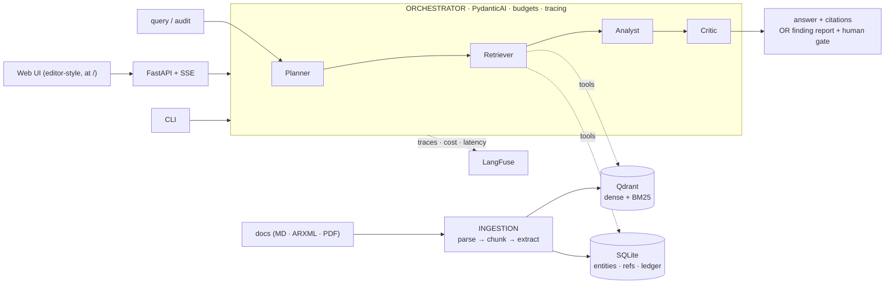

# Requirements Audit

> A multi-agent system over engineering specification documents that answers requirement queries with citations and **detects contradictions between requirements across documents** — with a measured evaluation harness, not vibes.

**Status:** Phases A–H implemented. Everything below — corpus, ingestion, four-agent pipeline, two-tier eval gate, four measured retrieval strategies, chunk-size sweep, FastAPI ops layer with SSE + per-request cost/latency, Docker, editor-style web UI — runs and is tested **without API keys**; the numbers tables mark exactly which rows still need a live (keyed) run. Remaining manual steps: the live/nightly runs, the bad-prompt CI-failure demo PR, and the Loom.

---

## The problem

Engineering organizations accumulate hundreds of requirement documents — AUTOSAR specs, internal requirements, supplier constraints, derived requirements across versions. The same parameter appears in three places with three different values. A constraint is tightened in one document and loosened in another. By the time the conflict is found, it's already in production code.

Traditional tools (DOORS, Jira, Windchill) catalog requirements; they don't reason about them. The newer option — "ask an LLM to find contradictions" — produces plausible-looking answers with no way to know if they're right.

## The approach

Requirements Audit is a multi-agent pipeline over a hybrid retrieval index, with a dedicated contradiction-detection mode that finds conflicts across documents and surfaces them with quoted evidence from both sources.

Two design choices drive everything else:

1. **Contradiction detection is an orchestration problem, not a prompting problem.** A single LLM call asking "find contradictions across these documents" is unreliable. The pipeline instead pairs candidate requirements by shared entity, compares values and constraints, verifies the conflict against quoted sources, and rejects false positives before surfacing anything.

2. **Evaluation is the product.** The synthetic corpus is generated with a known number of seeded contradictions of known types — so contradiction precision and recall are measurable by construction, not estimated by vibes. Every prompt or code change runs through an eval gate in CI; regressions fail the build.

## Architecture

```
docs (ARXML, MD, PDF) ──► INGESTION (parse → structure-aware chunk → entity/ref extract)
                                   ├── Qdrant (hybrid: dense + BM25)
                                   └── SQLite (entities, refs, content-hash ledger)

                          ORCHESTRATOR (PydanticAI · typed state · budgets · loop caps)
   query / audit  ──►  Planner ──► Retriever ──► Analyst ──► Critic ──►  answer + citations
                       (route,     (tools:        (draft     (verify              OR
                        decompose)  hybrid_search, answer /   claims vs           finding report
                                    get_section,   pair reqs  sources;            + human gate
                                    find_refs)     & compare) reject FPs)

                          OPS:  LangFuse traces · cost/latency per run · FastAPI + SSE · web UI · Docker
                          EVAL: golden set + seeded contradictions · Ragas + LLM-judge
                                in pytest · GitHub Actions gate
```

Rendered view of the same architecture:



**Agent roles**
- **Planner** — routes Q&A vs audit; decomposes complex queries.
- **Retriever** — typed tools over Qdrant: `hybrid_search`, `get_section`, `find_refs`.
- **Analyst** — drafts answers with inline citations; pairs requirements by shared entity for audit mode.
- **Critic** — verifies claims against quoted sources, rejects false positives, emits confidence.

## Why this beats a single LLM prompt

| Capability | Single-prompt LLM | Requirements Audit |
|---|---|---|
| Find contradictions across many docs | One shot — hallucinations possible | Pipeline pairs candidates, verifies against sources |
| Citations for both conflicting sources | Sometimes, unreliably | Always quoted, with source IDs |
| Precision / recall measurable | No ground truth → vibes | Seeded contradictions → numbers |
| Catches regressions before deploy | No | CI eval gate fails on faithfulness drop |
| Production observability | No | LangFuse traces, cost & latency per run |
| Human-in-the-loop gate on findings | No | Flagged contradictions surface for review |

## Evaluation methodology

This project enacts [Hamel Husain's L1/L2/L3 evals doctrine](https://hamel.dev/blog/posts/evals/):

- **L1 — assertions:** output schema, citation presence, tool-call shape, no-internal-fields-leak. Runs on every commit.
- **L2 — human + model evals:** golden-question set with expected sources; Ragas faithfulness, answer relevancy, context precision; LLM-judge with **precision/recall calibrated against hand-labeled items** rather than raw agreement. Runs nightly and in CI.
- **L3 — A/B tests:** out of MVP scope; documented in the roadmap.

The eval gate runs in two tiers (thresholds live in `evals/thresholds.yaml`):

- **Every commit, no API keys** (`pytest -m eval` in CI): retrieval `precision@k`/`recall@k` on the golden set, deterministic contradiction recall (numeric + superseded), and the L1 assertions. A retrieval or rule regression fails the build immediately.
- **Nightly / on demand, with keys** (`.github/workflows/eval-nightly.yml`): Ragas faithfulness/answer_relevancy/context_precision, the calibrated LLM-judge, and the full contradiction recall + before-vs-after-Critic precision. This is where a faithfulness or recall drop fails the build.

The LLM-judge is calibrated against `evals/judge_labels.json` (30 items) and reported as precision/recall, not raw agreement. Those labels are **construction-derived from the synthetic corpus** (seeded conflicts → yes, near-misses and clearly-unrelated pairs → no), not blind third-party human labels — the same synthetic-corpus tradeoff disclosed above, chosen so the calibration number is reproducible and versioned.

## Numbers

Everything below reproduces offline with no API keys (`make benchmark`, `make sweep`, `pytest -m eval`). Rows that require live LLM/embedding calls are marked and land via the nightly job / a keyed run.

### Retrieval strategies (34 source-bearing golden questions, k=5)

| Strategy | P@5 | R@5 | Notes |
|---|---|---|---|
| BM25 (lexical) | 0.312 | 0.926 | deterministic baseline, gated in CI |
| Dense (in-process Qdrant) | 0.300 | 0.912 | hashing embedder — a lexical proxy, disclosed in the report |
| Hybrid (RRF fusion) | 0.300 | 0.919 | deterministic given both arms |
| Hybrid + term-coverage rerank | 0.306 | 0.926 | recovers fusion's recall loss |
| Dense / hybrid with real embeddings | _live run pending_ | _live run pending_ | `--embedder openai`, pinned `text-embedding-3-small` |

### Chunk-size sweep (coverage-based metrics — see `eval/sweep.py` for definitions)

| Chunk budget | Chunks | P@5 | R@5 |
|---|---|---|---|
| per-requirement (production) | 180 | 0.312 | 0.926 |
| 256 / 512 / 1024 tokens | 171 | 0.318 | 0.926 |
| 32 tokens (exploratory) | 176 | 0.329 | 0.949 |

**Finding (a deliberate negative result):** this corpus's sections are smaller than the smallest planned budget, so 256/512/1024 all converge to section-sized chunks and the sweep is flat. Per-requirement chunking loses nothing and keeps citations exact — so it stays.

### Contradiction detection (15 seeded conflicts + 5 seeded near-misses)

| Pipeline | Precision | Recall | Near-miss FP rate |
|---|---|---|---|
| Deterministic rules only (no LLM, gated in CI) | 0.917 | 0.733 (11/15) | 0/5 |
| + LLM comparator & Critic (full pipeline, gpt-4o-mini) | 0.79 | 1.00 (15/15) | 0/5 |

The four conflicts the deterministic rules cannot reach are the prose `incompatible_constraint` cases (C07–C10) — that is precisely the LLM comparator's job. Live numbers are from a real run (~$0.006, ~110 s). Rule candidates bypass the Critic (they are high-precision by construction), so the deterministic recall is preserved and the comparator adds the prose class, reaching 15/15. Precision ~0.79 reflects gpt-4o-mini leaving a few comparator false positives through the Critic; no designated near-miss was ever flagged.

### Cost & latency

Per-request latency (per stage) and token usage with an estimated USD cost are captured on **every** run — in the CLI stats line, the API `trace` payload, and LangFuse when configured. Fleet numbers (cost per query / per full audit by provider, p95 per stage) require the live provider-comparison run: _pending, needs API keys_.

## Quickstart

```bash
uv sync                                 # install pinned deps
cp .env.example .env                    # add API keys (needed for query + full audit)
requirements-audit ingest corpus/       # build the index (no keys needed)
requirements-audit benchmark -s lexical -s dense -s hybrid   # retrieval benchmark (no keys: hash embedder; with OPENAI_API_KEY: real embeddings)
requirements-audit audit --no-llm       # deterministic sweep: numeric + superseded conflicts, no keys
requirements-audit query "What is the watchdog timeout?"   # Q&A with citations (needs a key)
requirements-audit audit                # full sweep incl. prose conflicts (needs a key)

make api                                # serve the FastAPI app on :8000 (SSE /query)
docker compose up -d                    # or: api + qdrant + langfuse in one command
make api                                # serves the editor-style web UI at http://localhost:8000/
```

`audit --no-llm` and the whole eval gate run offline; `query` and the full `audit`
call an LLM (OpenAI primary, Anthropic fallback) and require an API key.

The CLI is the primary interface; the API also serves an **editor-style web UI** at `/`. It opens on a **dashboard**: pick a document (any format, including an uploaded PDF) and run an audit scoped to it — compared against the rest of the corpus, so it's fast and focused — or sweep the full corpus. A **live progress overlay** (determinate bar + stage chips, driven by the `/audit/stream` SSE endpoint) tracks the run, including per-pair progress through the LLM comparator loop, the slowest stage. Results land in the **workspace**, laid out like an IDE: the left panel is an **audit-history explorer** that starts empty and fills with the documents you audit (persisted in `localStorage`), the full corpus stays reachable from a topbar **Corpus ▾** menu, opened documents stack as **closeable editor tabs**, audit findings appear as inline problems (squiggles + a VS Code-style Problems panel with severity **filter + search**), and query answers cite requirements you can jump to. Every finding has a **⇄ Resolve** button that opens a Beyond-Compare-style split view: a live word-level **diff strip** highlights what differs between the two sides, and you edit either side's text or the specific differing parameter (with a one-click "use this" sync across). Saving records the edit and closes — the edited requirement shows an inline red/green **old-vs-new diff** in the editor, and the audit is marked **stale** (amber Run-audit button + status-bar count) so you resolve every conflict first and **re-run the audit once, manually**, instead of triggering the slow LLM sweep after each edit. Self-contained static HTML/CSS/JS: no build step, no extra dependency.

## Runbook

| I want to… | Run |
|---|---|
| Install everything (dev + eval + ui) | `make install` |
| Regenerate the synthetic corpus + ground truth | `make corpus` |
| Build the index | `make ingest` (or `POST /ingest`) |
| Ask a question | `make query Q="…"` (needs a key) |
| Sweep for contradictions | `make audit` (keyless = deterministic classes); scope to one doc with `POST /audit {"doc_id": "SYS"}`; stream progress via `POST /audit/stream` (SSE) |
| Benchmark retrieval strategies | `make benchmark STRATEGIES="lexical dense hybrid hybrid_rerank"` |
| Run the chunk-size sweep | `make sweep` |
| Serve the API | `make api` → http://localhost:8000 (OpenAPI docs at `/docs`) |
| Open the web UI | `make api`, then http://localhost:8000/ (ships with the API) |
| Add your own spec | UI explorer ⬆ button, or `POST /upload` a `.md`/`.pdf` (saved to `data/uploads/`, ingested server-side) |
| Resolve a conflict | UI Problems row/card → **⇄ Resolve** → edit → Save (marks the audit stale; re-run it manually when done), or `PATCH /requirements/{id}` directly (saves a convenience copy to `data/corrected/`, never the original) |
| Start everything in Docker | `docker compose up -d` (api + qdrant + langfuse) |
| Run what CI runs | `make check` · eval gate only: `make eval` |

**Common failures:** `503` from `/query` = no LLM key configured (set `ANTHROPIC_API_KEY` or `OPENAI_API_KEY`; the deterministic endpoints keep working keyless). "No chunks found" = run ingest first. CI format failures = run `make format` before committing.

## Limitations (read before judging the numbers)

- **The corpus is synthetic and the ground truth is construction-derived.** That's the point — precision/recall are measurable by construction — but it means the numbers characterize the *harness*, not performance on messy real-world specs. The judge calibration labels share this provenance (disclosed above).
- **Keyless dense/hybrid numbers use a hashing embedder,** which is a lexical proxy: they demonstrate the wiring and a floor, not semantic retrieval. Every benchmark row names its embedder so the two can never be conflated.
- **Ingestion consumes Markdown and text-based PDF.** Both the generated corpus style (`### ID — Title` + metadata bullets) and real-world specs (inline-bold `**HL-FUN-001**` IDs, numbered sections) parse. PDF quality depends on the exporter: text PDFs from Word/LaTeX/pandoc work well; scanned/image PDFs (OCR territory) and heavy multi-column layouts do not, and marker-stripped exports can surface referenced-document IDs as spurious requirements. ARXML is still unimplemented.
- **Requirement-atomic chunking** is validated on this corpus (see the sweep's negative result) but unvalidated on documents with long free-text requirements.
- **Single-tenant, no auth, SQLite single-writer.** The API is a local/demo ops layer, not a hardened service.
- **Human review decisions (accept/dismiss) are session-only** in the UI; they are not persisted through the API.
- **SSE streams pipeline stages, not tokens.** Token-level streaming is roadmap.
- English-only corpus and prompts.

## Scope

**In scope for the MVP:**
- Multi-format ingestion (Markdown + text-based PDF; ARXML roadmap) with structure-aware chunking
- Hybrid retrieval (dense + BM25) over Qdrant; SQLite entity / reference tables
- Four-agent pipeline (Planner → Retriever → Analyst → Critic) in PydanticAI
- Evaluation harness with golden set, contradiction ground truth, Ragas, calibrated LLM-judge, CI gate
- FastAPI + SSE, Docker compose, LangFuse tracing, provider fallback (OpenAI ↔ Anthropic)
- Editor-style web UI served by the API — documents as source files, findings as inline problems, query with jump-to-citation

**Deliberately out of scope (roadmap):**
- Graph store (Neo4j) — SQLite reference tables cover contradiction pairing at MVP scale
- Heavyweight custom frontend (SPA framework/build step) — the UI is self-contained static HTML/CSS/JS served by the API
- n8n folder/webhook ingestion automation — paused, revisit post-MVP
- Fine-tuning, self-hosted models, authentication, multi-tenancy

## Roadmap

Ordered by what the measurements say matters next:

1. **Live benchmark runs** — dense/hybrid with real OpenAI embeddings, Ragas + judge + full contradiction recall nightly, both providers through the full eval suite, cost/p95 fleet numbers. (Everything is wired; these need API keys and a scheduled run.)
2. **Swap the agents' `hybrid_search`** to the winning retrieval strategy — only if the live numbers beat BM25 on this task.
3. **Persist human review decisions** (accept/dismiss) through the API; today they are session-only in the UI.
4. **Resolve view for `superseded_reference` findings** — repointing a reference to its replacement requirement. The resolve view today covers `numeric_mismatch` (parameter sync) and `incompatible_constraint` (free-text edit); superseded references need a "retarget this ref" control instead.
5. **Cross-encoder / LLM reranker** behind the same benchmark row that currently measures the term-coverage reranker.
6. **Dense vectors at ingest time** against the served Qdrant (the benchmark embeds on the fly today).
7. **Token-level SSE streaming** on `/query` (stages stream today).
8. Wire ARXML parsing into the ingestion glob (Markdown + PDF already supported); n8n ingestion automation (paused); Neo4j when multi-hop traceability justifies it; auth + multi-tenancy.

## Repository layout

```
requirements-audit/
├── src/requirements_audit/
│   ├── corpus/          # deterministic synthetic-corpus + ground-truth generator
│   ├── ingestion/       # parser, requirement-atomic chunker, entity/ref extract, SQLite store
│   ├── retrieval/       # lexical BM25 · dense (Qdrant) · RRF fusion · rerank · embedders
│   ├── agents/          # Planner, Analyst, Comparator, Critic (PydanticAI)
│   ├── tools/           # typed retrieval tools the Analyst calls
│   ├── llm/             # provider abstraction + fallback, pinned pricing
│   ├── eval/            # retrieval/contradiction/judge/Ragas metrics, benchmark, sweep
│   ├── api/             # FastAPI ops layer (SSE /query) + static/ editor web UI
│   ├── orchestrator.py  # the two entrypoints: answer_query, run_audit
│   └── tracing.py       # in-memory RunTrace always; LangFuse export when keyed
├── evals/               # golden_set.json, contradictions.json, judge_labels.json, eval gate tests
├── corpus/              # the generated requirement documents (8 docs, 15 seeded conflicts)
├── tests/               # unit + wiring tests (all keyless)
├── .github/workflows/   # ci.yml (every commit, keyless) · eval-nightly.yml (live)
├── Dockerfile           # the api image
└── docker-compose.yml   # api + qdrant + langfuse
```

## License

MIT — see [LICENSE](LICENSE).
